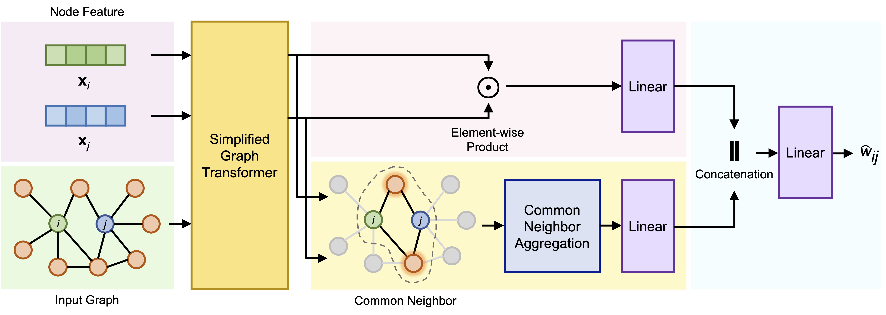

# CoNe

This is the PyTorch implementation of **Common Neighbor-aware Link Weight Prediction with Simplified Graph Transformer**.



## Requirements

- Environment:
  - Python == 3.10
  - Nvidia RTX 4090 with CUDA 12.1

- Package dependencies:
  - PyTorch == 2.1.0
  - PyTorch Geometric == 2.4.0

## How to run

The commands and hyperparameter settings are provided in the `run.sh` script. The datasets will be automatically downloaded from the internet during program execution. Make sure the folder `data` exists in the root directory.

```shell
# Neural
python main.py --dataset_name Neural --walk_length 64 --rwpe_use_weight 0 --hidden_channels 64 --num_layers 2 --lr 0.0005 --lr_decay 0.9 --weight_decay 0.1 --batch_size 256

# Celegans
python main.py --dataset_name Celegans --walk_length 64 --rwpe_use_weight 1 --hidden_channels 64 --num_layers 4 --lr 0.005 --lr_decay 0.8 --weight_decay 0.1 --batch_size 64

# Netscience
python main.py --dataset_name Netscience --walk_length 64 --rwpe_use_weight 0 --hidden_channels 64 --num_layers 3 --lr 0.01 --lr_decay 0.95 --weight_decay 0.02 --batch_size 512

# Pblog
python main.py --dataset_name Pblog --walk_length 64 --rwpe_use_weight 0 --hidden_channels 64 --num_layers 3 --lr 0.01 --lr_decay 0.9 --weight_decay 0.05 --batch_size 256

# UCsocial
python main.py --dataset_name UCsocial --walk_length 64 --rwpe_use_weight 0 --hidden_channels 64 --num_layers 3 --lr 0.05 --lr_decay 0.65 --weight_decay 0.2 --batch_size 256

# Condmat
python main.py --dataset_name Condmat --walk_length 16 --rwpe_use_weight 1 --hidden_channels 16 --num_layers 3 --lr 0.001 --lr_decay 0.95 --weight_decay 0.05 --batch_size 512

# Astro
python main.py --dataset_name Astro --walk_length 32 --rwpe_use_weight 0 --hidden_channels 32 --num_layers 2 --lr 0.001 --lr_decay 0.95 --weight_decay 0.05 --batch_size 512

# Collaboration
python main.py --dataset_name Collaboration --walk_length 64 --rwpe_use_weight 0 --hidden_channels 64 --num_layers 3 --lr 0.0001 --lr_decay 0.95 --weight_decay 0.1 --batch_size 256

# Congress
python main.py --dataset_name Congress --walk_length 32 --rwpe_use_weight 0 --hidden_channels 32 --num_layers 3 --lr 0.0005 --lr_decay 0.99 --weight_decay 0.1 --batch_size 1024

# Usair
python main.py --dataset_name Usair --walk_length 128 --rwpe_use_weight 0 --hidden_channels 128 --num_layers 3 --lr 0.001 --lr_decay 0.95 --weight_decay 0.3 --batch_size 64
```

## Baselines

All repositories of the compared methods are listed below.

- Deepwalk & node2vec: https://colab.research.google.com/github/AntonioLonga/PytorchGeometricTutorial/blob/main/Tutorial11/Tutorial11.ipynb

- GraRep & LINE: https://github.com/iamlockelightning/NetworkEmbeddingPytorch

- SDNE: https://github.com/MrLeeeee/SDNE-based-on-Pytorch

- GAE & VGAE: https://github.com/pyg-team/pytorch_geometric/blob/master/examples/autoencoder.py

- GCN: https://github.com/pyg-team/pytorch_geometric/blob/master/examples/gcn.py
- rWCN & rWAA & rWRA: Modified from https://networkx.org/documentation/stable/reference/algorithms/link_prediction.html
- SBM & pWSBM & bWSBM: https://aaronclauset.github.io/wsbm/
- GWNMF: Modified from https://github.com/ahmadvh/Non-Negative-Matrix-factorization---Implemented-in-python/blob/master/The%20notebook.ipynb
- LG-RF & LG-GBDT & LG-SVM: Available upon request from the author via email.
- LWP-WL: https://github.com/unai-zulaika/LWP-WL-Pytorch
- LGLWP: Modified from https://github.com/LeiCaiwsu/LGLP
- Model R: https://github.com/yuchenhou/elephant
- MPLP: Available upon request from the author via email.
- NEW: https://github.com/Lee425/NEW
- SEA: https://github.com/wave-zuo/SEA
